**Category:** Web
**Author:** *Harsh Sharma*

# Team

## Enumeration using nmap

`nmap -sV -sC -p- 10.10.255.216`

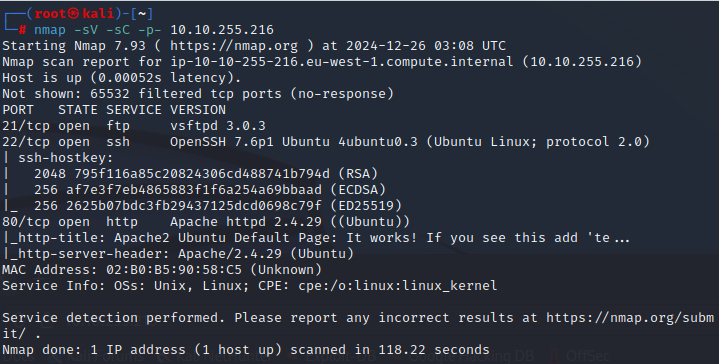

## Directory Enumeration

`gobuster dir -u 10.10.255.216 -w /usr/share/dirb/wordlists/common.txt -x html,php -q`

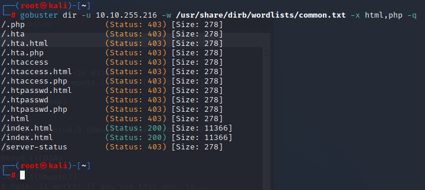

nothing much, so i check the source code and I found this-

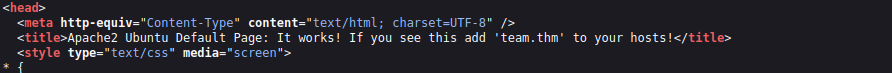

`echo "10.10.255.216 team.thm" >> /etc/hosts`

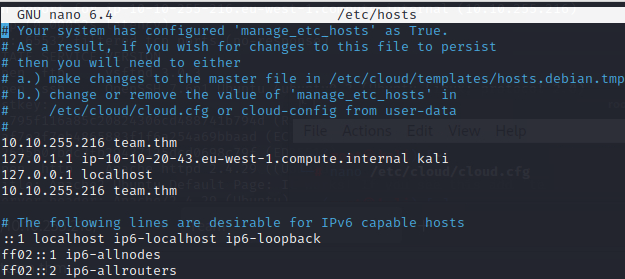

`team.thm` will take you to google but if u suffix http, it will show you the site

quickly analysing the source code, nothing of interest is found

let's run gobuster again, here's what i get-

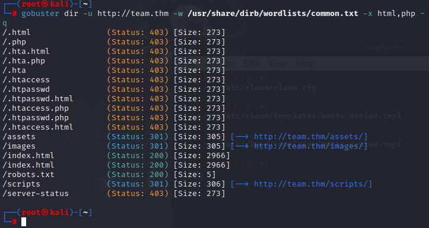

dont have access to scripts or assets but here's what robots.txt says-

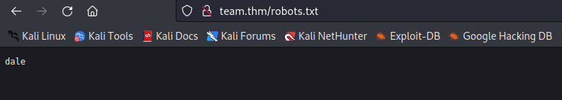

> *"dale"* seems to be a username - let's try ssh and ftp

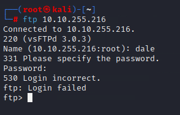

### How about brute forcing with hydra?

`hydra -l dale -P /usr/share/wordlists/rockyou.txt ssh://10.10.255.216`

> waited for hours but nothing :(

let's try something else, enumerating the sub directories with different file types and bigger wordlist

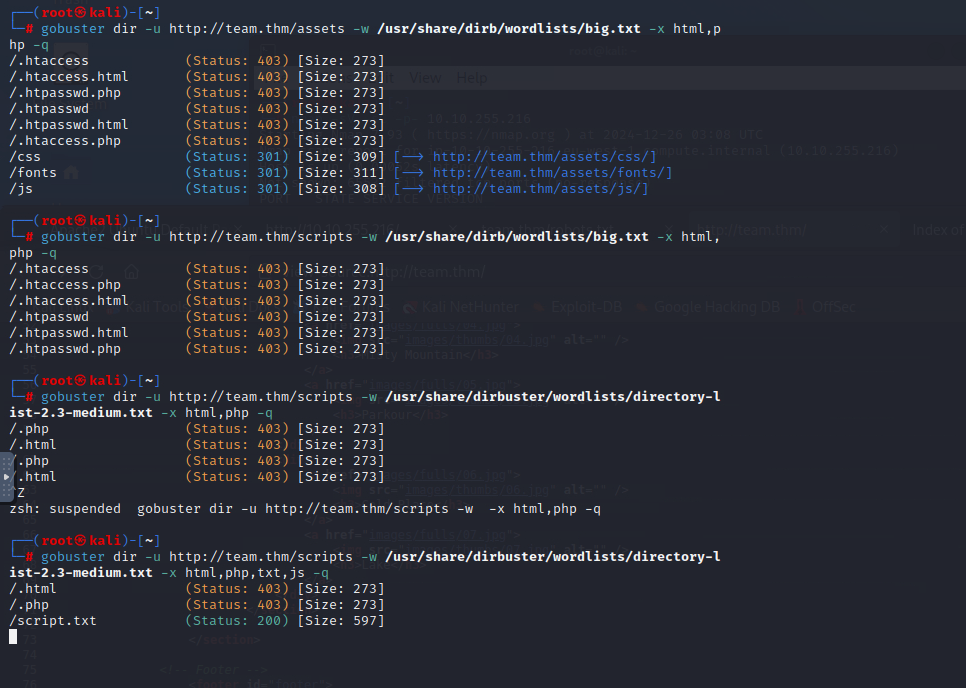

there's a `script.txt` file under scripts sub-directory, let's check it ou

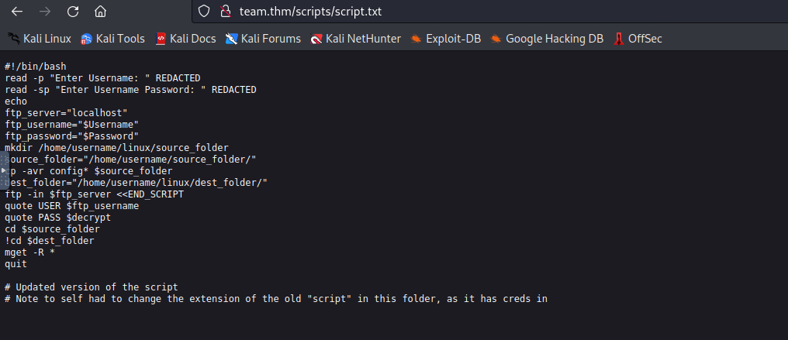

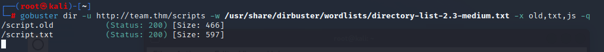

Navigating to the file will give you the credentials,

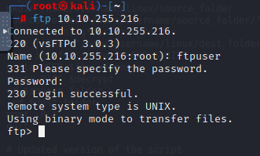

login successful!

found a folder by the name of 'workshare' with a textfile in it, let's quickly `get` it.

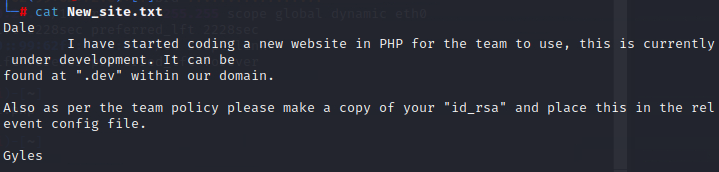

- Adding `.dev.team.thm` to our hosts, here's what we get

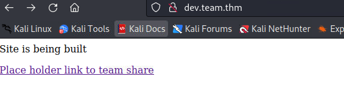

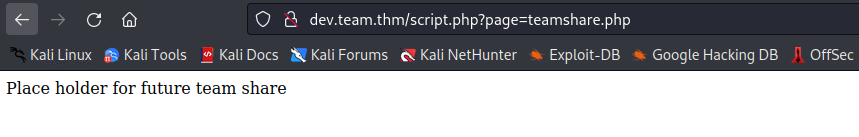

### LFI exploit

Manipulating the page url, we can find the flag

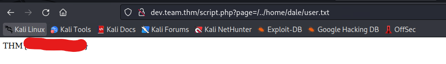

> Pretend as if we are exploring the file system on a reverse shell or ssh perhaps

## Getting a shell; Privilege Escalation

let's exploit this LFI vulnerability and fire up burpsuite

I will be using the payload provided by [emadshanab](https://raw.githubusercontent.com/emadshanab/LFI-Payload-List/refs/heads/master/LFI%20payloads.txt)

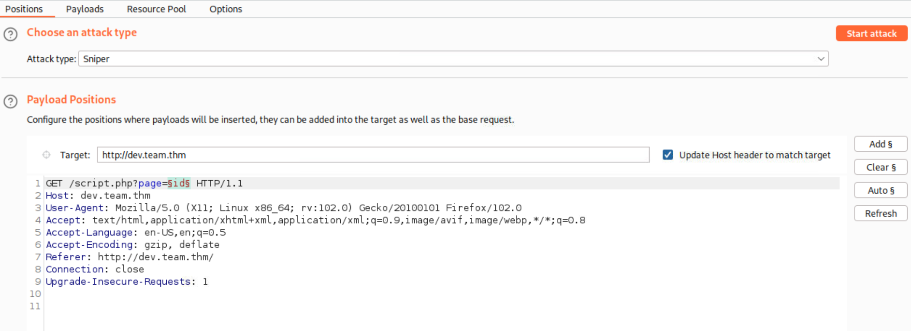

after poking around multiple directories, found a directory with ssh keys as was talked about in the note-
> etc/ssh/sshd_config

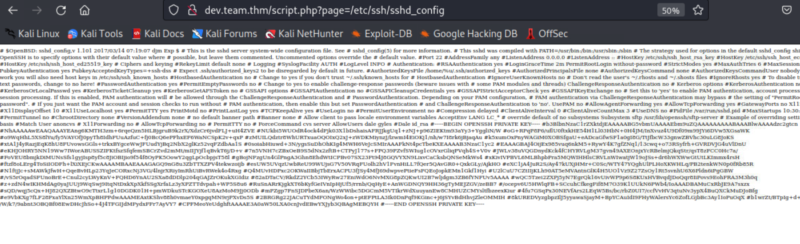

### SSH

I saved the file locally and tried to ssh in
> Had to remove all the ' #' or else it will trigger libcrypto - trying opening in vim to understand what's happening (those are all comments)

`ssh -i dale_rsa dale@10.10.255.216`

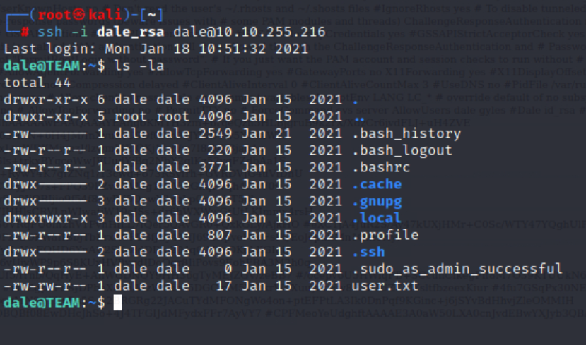

..and we are in

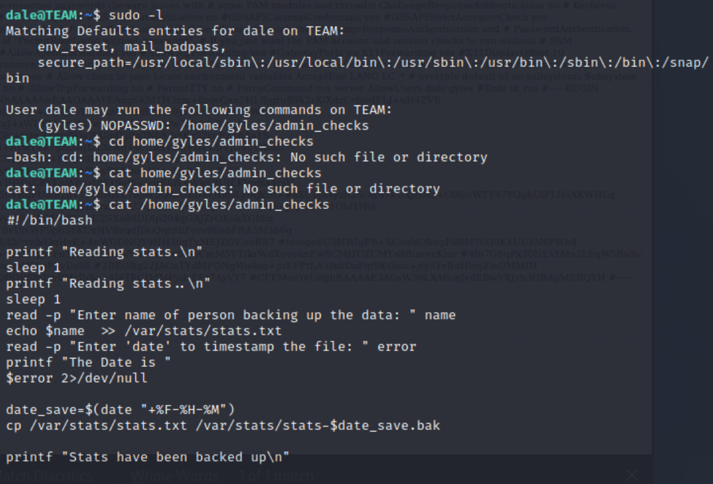

The file's not modifiable, time to run linpeas.sh-

`sudo python3 -m http.server 1000` on our machine
` `

    CONTINUTE TOMOEOROW

    
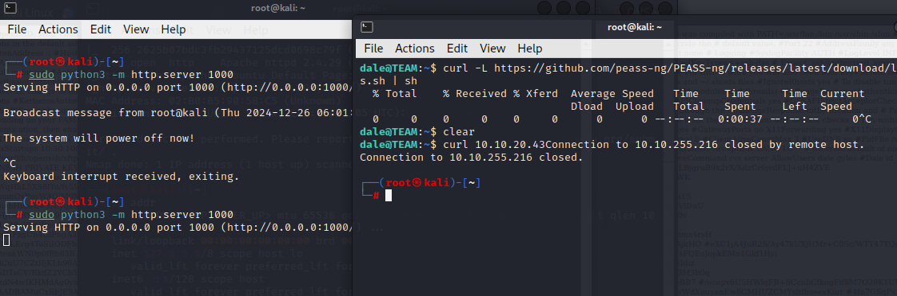

