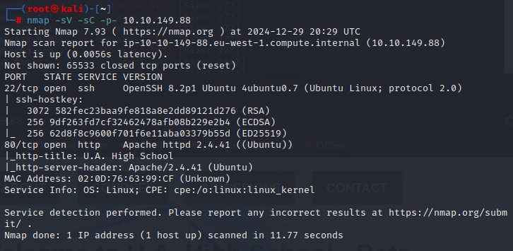
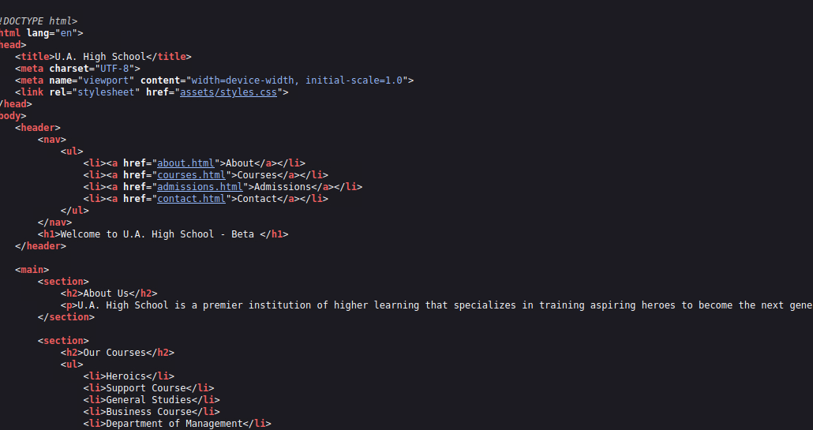
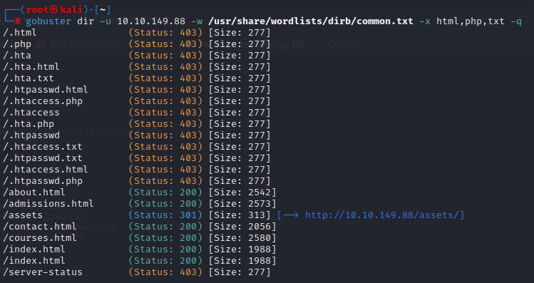
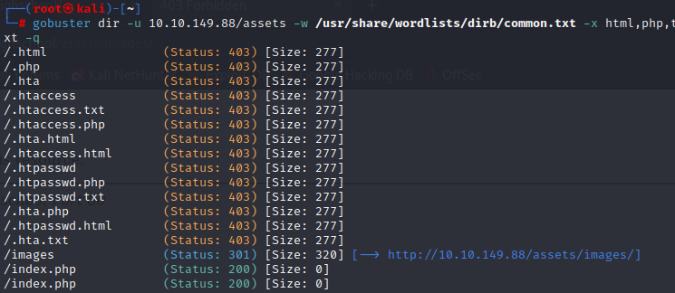
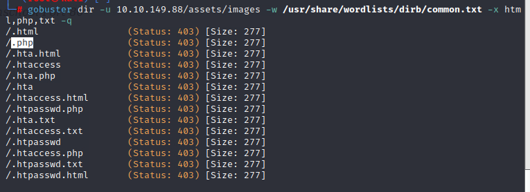
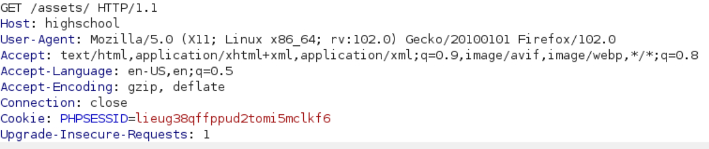

**Category:** Web
**Author:** *Harsh Sharma*

# Yueiua

## Enumeration using nmap

`nmap -sV -sC -p- 10.10.149.88`

2 ports are open, let's visit the http first-

No relevant info on the source page as well...

### Directory enumeration

`gobuster dir -u 10.10.149.88 -w /usr/share/wordlists/dirb/common.txt -x html,php,txt -q`

> searching for html, txt and php file extensions and the -q option to suppress noise

burp suite!

phpsessid! a php file running in assets? interesting

let's try index.php-

